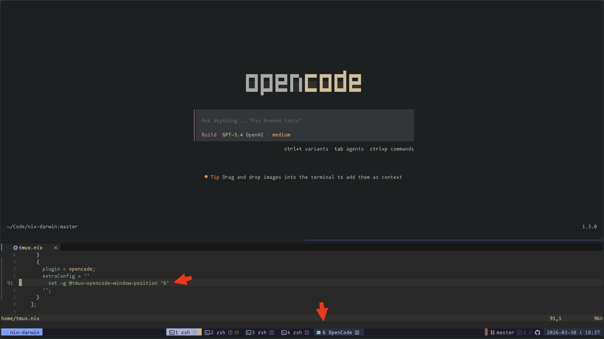

# tmux-opencode

Open a single [OpenCode](https://github.com/sst/opencode) window inside tmux and
reuse it across the current tmux session.



Idea is that you have single bind in memory that will always open OpenCode and preferably in the same window, but either way you just have bind to get to ai in this session (and you keep same path in all windows).

## Installation

### Manual installation

Clone this folder wherever you keep your tmux plugins, then add this line to
your `tmux.conf`:

```bash
run-shell <clone-path>/tmux-opencode.tmux
```

Reload tmux:

```bash
tmux source-file <tmux.conf-path>
```

## Behavior

Opening OpenCode reuses a single window per tmux session. The plugin stores the
tracked window id directly in tmux session memory using a session-scoped user
option. If that window already exists, it focuses it instead of creating a new
one.

## Configuration options

### `@tmux-opencode-open`

**Default: a (prefix+a)**

Key used to open OpenCode.

```bash
set -g @tmux-opencode-open 'a'
```

### `@tmux-opencode-window-position`

**Default: unset**

Preferred tmux window index for a newly created OpenCode window. If that index is
already occupied, the plugin uses the next free index. Leave it unset to keep the
default tmux placement behavior.

```bash
set -g @tmux-opencode-window-position '3'
```
